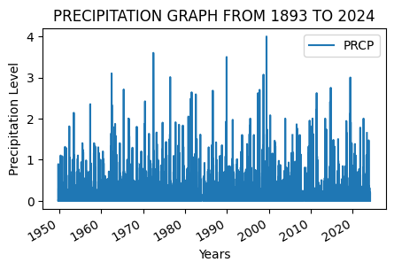

# Get started with open reproducible science!

[Open reproducible
science](https://www.earthdatascience.org/courses/intro-to-earth-data-science/open-reproducible-science/get-started-open-reproducible-science/)
makes scientific methods, data and outcomes available to everyone. That
means that *everyone* who wants should be able to **find**, **read**,
**understand**, and **run** your workflows for themselves.


> Image from
> https://www.earthdata.nasa.gov/esds/open-science/oss-for-eso-workshops

Few if any science projects are 100% open and reproducible (yet!).
However, members of the open science community have developed open
source tools and practices that can help you move toward that goal. You
will learn about many of those tools in [the Intro to Earth Data Science
textbook](https://www.earthdatascience.org/courses/intro-to-earth-data-science/).
Don’t worry about learning all the tools at once – we’ve picked a few
for you to get started with.

------------------------------------------------------------------------

> **<i class="fa fa-solid fa-glasses fa-large" aria-label="glasses"></i>
> Further reading**
>
> Read [our textbook chapter about open reproducible
> science](https://www.earthdatascience.org/courses/intro-to-earth-data-science/open-reproducible-science/get-started-open-reproducible-science/).

## Why Open Reproducible Science
Open reproducible science is a transparent sharable flow of analysis that is accessible to the community
GitHub is one of the best open source tool for open reproducible science. It is free to create github account and also free use it. One can easily upload his/her work there are share with otheres. It also allows you to contribut to someones work through forking or as a collaborator.

------------------------------------------------------------------------

## **Readable, well-documented scientific workflows are easier to reproduce**

As the comic below suggests, code that is hard to read is also hard to
get working. We refer to code that is easy to read as **clean** code.

<figure>
<a
href="https://www.explainxkcd.com/wiki/index.php/2138:_Wanna_See_the_Code%3F"></a>
<figcaption>And because if you just leave it there, it’s going to start
contaminating things downstream even if no one touches it directly.
(from [XKCD](https://xkcd.com/2138/))</figcaption>
</figure>

> **<i class="fa fa-solid fa-pencil fa-large" aria-label="pencil"></i>**
## Things that you can do to write clean code, and

You can write clean code by: Utilizing comments and use the standard naming convention. By also using human readable name to name functions and variable.

Advantages of clean code include: Easy to read and understand the flow of the code, easy to edit and all this makes the code reproducible.

> **<i class="fa fa-solid fa-keyboard fa-large" aria-label="keyboard"></i>
> Coding task**
>
> 1.  We start by importing the pandas package


```python
# Import pandas
import pandas as pd
```

------------------------------------------------------------------------

## There are more Earth Observation data online than any one person could ever look at

[NASA’s Earth Observing System Data and Information System (EOSDIS)
alone manages over 9PB of
data](https://www.earthdata.nasa.gov/learn/articles/getting-petabytes-people-how-eosdis-facilitates-earth-observing-data-discovery-and-use).
1 PB is roughly 100 times the entire Library of Congress (a good
approximation of all the books available in the US). It’s all available
to **you** once you learn how to download what you want.

Here we’re using the NOAA National Centers for Environmental Information
(NCEI) [Access Data
Service](https://www.ncei.noaa.gov/support/access-data-service-api-user-documentation)
application progamming interface (API) to request data from their web
servers. We will be using data collected as part of the Global
Historical Climatology Network daily (GHCNd) from their [Climate Data
Online library](https://www.ncdc.noaa.gov/cdo-web/datasets) program at
NOAA.

For this example we’re requesting [daily summary data in Boulder, CO
(station ID
USC00050848)](https://www.ncdc.noaa.gov/cdo-web/datasets/GHCND/stations/GHCND:USC00050848/detail)
located on the NOAA Campus (**39.99282°, -105.26683°**).

**Global Historical Climatology Network** 🛎️

The [**Global Historical Climatology Network -
 Daily**](https://www.ncei.noaa.gov/metadata/geoportal/rest/metadata/item/gov.noaa.ncdc:C00861/html) is a comprehensive data source managed by the National Oceanic and Atmospheric Administration (NOAA). It consists of daily climate records from thousands of land surface stations across the globe, including maximum and minimum temperatures, precipitation, snowfall, and snow depth. The maximum temperature data are recorded in degrees Celsius. Data collection is performed through a network of meteorological stations, both manned and automatic, and is standardized to ensure consistency and reliability across different locations and time periods.

Citation:
Menne, M.J., I. Durre, B. Korzeniewski, S. McNeal, K. Thomas, X. Yin, S. Anthony, R. Ray, R.S. Vose, B.E. Gleason, and T.G. Houston, 2012: Global Historical Climatology Network - Daily (GHCN-Daily), Version 3. [indicate subset used following decimal, e.g. Version 3.12]. NOAA National Climatic Data Center. doi:10.7289/V5D21VHZ.

## **You can access NCEI GHCNd Data from the internet using its API** 🖥️ 📡 🖥️

The cell below contains the URL for the data you will use in this part
of the notebook. We created this URL by generating what is called an
**API endpoint** using the NCEI [API
documentation](https://www.ncei.noaa.gov/support/access-data-service-api-user-documentation).

> **Note**
>
> An **application programming interface** (API) is a way for two or
> more computer programs or components to communicate with each other.
> It is a type of software interface, offering a service to other pieces
> of software ([Wikipedia](https://en.wikipedia.org/wiki/API)).

However, we still have a problem - we can’t get the URL back later on
because it isn’t saved in a **variable**. In other words, we need to
give the url a name so that we can request in from Python later (sadly,
Python has no ‘hey what was that thingy I typed yesterday?’ function).

> **<i class="fa fa-solid fa-glasses fa-large" aria-label="glasses"></i>
> Read more**
>
> Check out the [textbook section on
> variables](https://www.earthdatascience.org/courses/intro-to-earth-data-science/python-code-fundamentals/get-started-using-python/variables/)

> **<i class="fa fa-solid fa-keyboard fa-large" aria-label="keyboard"></i>**


```python
climate_data_url = (
    'https://www.ncei.noaa.gov/access/services/data/v1'
    '?dataset=daily-summaries'
    '&dataTypes=TOBS,PRCP'
    '&stations=USC00396947'
    '&startDate=1949-10-01'
    '&endDate=2024-02-18'
    '&includeStationName=true'
    '&includeStationLocation=1'
    '&units=standard')
climate_data_url
```


    'https://www.ncei.noaa.gov/access/services/data/v1?dataset=daily-summaries&dataTypes=TOBS,PRCP&stations=USC00396947&startDate=1949-10-01&endDate=2024-02-18&includeStationName=true&includeStationLocation=1&units=standard'


------------------------------------------------------------------------

## **Download and get started working with NCEI data**

The `pandas` library imported can download data from the internet
directly into a type of Python **object** called a `DataFrame`. In the
code cell below, 

I used `.read_csv()` statement to include the following
>     parameters:
>
>     -   `index_col='DATE'` – this sets the `DATE` column as the index.
>         Needed for subsetting and resampling later on
>     -   `parse_dates=True` – this lets `python` know that you are
>         working with time-series data, and values in the indexed
>         column are **date time objects**
>     -   `na_values=['NaN']` – this lets `python` know how to handle
>         missing values


```python
climate_data_df = pd.read_csv(
  climate_data_url,
  index_col='DATE',
  parse_dates=True,
  na_values='[NaN]'
  )
climate_data_df
```


<div>
<style scoped>
    .dataframe tbody tr th:only-of-type {
        vertical-align: middle;
    }

    .dataframe tbody tr th {
        vertical-align: top;
    }

    .dataframe thead th {
        text-align: right;
    }
</style>
<table border="1" class="dataframe">
  <thead>
    <tr style="text-align: right;">
      <th></th>
      <th>STATION</th>
      <th>NAME</th>
      <th>LATITUDE</th>
      <th>LONGITUDE</th>
      <th>ELEVATION</th>
      <th>PRCP</th>
      <th>TOBS</th>
    </tr>
    <tr>
      <th>DATE</th>
      <th></th>
      <th></th>
      <th></th>
      <th></th>
      <th></th>
      <th></th>
      <th></th>
    </tr>
  </thead>
  <tbody>
    <tr>
      <th>1949-10-01</th>
      <td>USC00396947</td>
      <td>RAPID CITY 4 NW, SD US</td>
      <td>44.12055</td>
      <td>-103.28417</td>
      <td>1060.4</td>
      <td>0.00</td>
      <td>51.0</td>
    </tr>
    <tr>
      <th>1949-10-02</th>
      <td>USC00396947</td>
      <td>RAPID CITY 4 NW, SD US</td>
      <td>44.12055</td>
      <td>-103.28417</td>
      <td>1060.4</td>
      <td>0.00</td>
      <td>51.0</td>
    </tr>
    <tr>
      <th>1949-10-03</th>
      <td>USC00396947</td>
      <td>RAPID CITY 4 NW, SD US</td>
      <td>44.12055</td>
      <td>-103.28417</td>
      <td>1060.4</td>
      <td>0.00</td>
      <td>52.0</td>
    </tr>
    <tr>
      <th>1949-10-04</th>
      <td>USC00396947</td>
      <td>RAPID CITY 4 NW, SD US</td>
      <td>44.12055</td>
      <td>-103.28417</td>
      <td>1060.4</td>
      <td>0.00</td>
      <td>45.0</td>
    </tr>
    <tr>
      <th>1949-10-05</th>
      <td>USC00396947</td>
      <td>RAPID CITY 4 NW, SD US</td>
      <td>44.12055</td>
      <td>-103.28417</td>
      <td>1060.4</td>
      <td>0.00</td>
      <td>50.0</td>
    </tr>
    <tr>
      <th>...</th>
      <td>...</td>
      <td>...</td>
      <td>...</td>
      <td>...</td>
      <td>...</td>
      <td>...</td>
      <td>...</td>
    </tr>
    <tr>
      <th>2024-02-14</th>
      <td>USC00396947</td>
      <td>RAPID CITY 4 NW, SD US</td>
      <td>44.12055</td>
      <td>-103.28417</td>
      <td>1060.4</td>
      <td>0.15</td>
      <td>24.0</td>
    </tr>
    <tr>
      <th>2024-02-15</th>
      <td>USC00396947</td>
      <td>RAPID CITY 4 NW, SD US</td>
      <td>44.12055</td>
      <td>-103.28417</td>
      <td>1060.4</td>
      <td>0.03</td>
      <td>21.0</td>
    </tr>
    <tr>
      <th>2024-02-16</th>
      <td>USC00396947</td>
      <td>RAPID CITY 4 NW, SD US</td>
      <td>44.12055</td>
      <td>-103.28417</td>
      <td>1060.4</td>
      <td>0.20</td>
      <td>8.0</td>
    </tr>
    <tr>
      <th>2024-02-17</th>
      <td>USC00396947</td>
      <td>RAPID CITY 4 NW, SD US</td>
      <td>44.12055</td>
      <td>-103.28417</td>
      <td>1060.4</td>
      <td>0.00</td>
      <td>NaN</td>
    </tr>
    <tr>
      <th>2024-02-18</th>
      <td>USC00396947</td>
      <td>RAPID CITY 4 NW, SD US</td>
      <td>44.12055</td>
      <td>-103.28417</td>
      <td>1060.4</td>
      <td>0.00</td>
      <td>NaN</td>
    </tr>
  </tbody>
</table>
<p>26042 rows × 7 columns</p>
</div>


> HINT: Check out the `type()` function below - you can use it to check
> that your data is now in `DataFrame` type object


```python
# Check that the data was imported into a pandas DataFrame
type(climate_data_df)
```


    pandas.core.frame.DataFrame


> **<i class="fa fa-solid fa-keyboard fa-large" aria-label="keyboard"></i>
> Clean up your DataFrame**
>
> Use double brackets to only select the columns you want in your
> DataFrame

**Make sure to call your `DataFrame` by typing it’s name as the last
line of your code cell** Then, you will be able to run the test cell
below and find out if your answer is correct.


```python
climate_data_df = climate_data_df[['PRCP', 'TOBS']]
climate_data_df
```


<div>
<style scoped>
    .dataframe tbody tr th:only-of-type {
        vertical-align: middle;
    }

    .dataframe tbody tr th {
        vertical-align: top;
    }

    .dataframe thead th {
        text-align: right;
    }
</style>
<table border="1" class="dataframe">
  <thead>
    <tr style="text-align: right;">
      <th></th>
      <th>PRCP</th>
      <th>TOBS</th>
    </tr>
    <tr>
      <th>DATE</th>
      <th></th>
      <th></th>
    </tr>
  </thead>
  <tbody>
    <tr>
      <th>1949-10-01</th>
      <td>0.00</td>
      <td>51.0</td>
    </tr>
    <tr>
      <th>1949-10-02</th>
      <td>0.00</td>
      <td>51.0</td>
    </tr>
    <tr>
      <th>1949-10-03</th>
      <td>0.00</td>
      <td>52.0</td>
    </tr>
    <tr>
      <th>1949-10-04</th>
      <td>0.00</td>
      <td>45.0</td>
    </tr>
    <tr>
      <th>1949-10-05</th>
      <td>0.00</td>
      <td>50.0</td>
    </tr>
    <tr>
      <th>...</th>
      <td>...</td>
      <td>...</td>
    </tr>
    <tr>
      <th>2024-02-14</th>
      <td>0.15</td>
      <td>24.0</td>
    </tr>
    <tr>
      <th>2024-02-15</th>
      <td>0.03</td>
      <td>21.0</td>
    </tr>
    <tr>
      <th>2024-02-16</th>
      <td>0.20</td>
      <td>8.0</td>
    </tr>
    <tr>
      <th>2024-02-17</th>
      <td>0.00</td>
      <td>NaN</td>
    </tr>
    <tr>
      <th>2024-02-18</th>
      <td>0.00</td>
      <td>NaN</td>
    </tr>
  </tbody>
</table>
<p>26042 rows × 2 columns</p>
</div>


------------------------------------------------------------------------

## Plot the precpitation column (PRCP) vs time to explore the data

Plotting in Python is easy, but not quite this easy:


```python
climate_data_df.plot()
```


    <Axes: xlabel='DATE'>


    

    


You’ll always need to add some instructions on labels and how you want
your plot to look.

> **<i class="fa fa-solid fa-keyboard fa-large" aria-label="keyboard"></i>
> Your task:**
>
> 1.  Change `dataframe` to **your** `DataFrame` name.
> 2.  Change `y=` to the name of your **observed temperature** column
>     name.
> 3.  Use the `title`, `ylabel`, and `xlabel` parameters to add key text
>     to your plot.
> 4.  Adjust the size of your figure using `figsize=(x,y)` where `x` is
>     figure width and `y` is figure height
>
> > **HINT:** labels have to be a *type* in Python called a **string**.
> > You can make a string by putting quotes around your label, just like
> > the column names in the sample code (eg `y='TOBS'`).


```python
# Plot the data using .plot
climate_data_df.plot(
    y='PRCP',
    title='PRECIPITATION GRAPH FROM 1893 TO 2024',
    xlabel='Years',
    ylabel='Precipitation Level',
    figsize=(5,3)
    )
```


    <Axes: title={'center': 'PRECIPITATION GRAPH FROM 1893 TO 2024'}, xlabel='Years', ylabel='Precipitation Level'>


    

    


------------------------------------------------------------------------

> **<i class="fa fa-solid fa-pepper-hot fa-large" aria-label="pepper-hot"></i>
> Convert units**
>
> We are going to add new a column that includes temperature in
> Celsius**. 


```python
# Convert to celcius
climate_data_df = climate_data_df.dropna()
climate_data_df.loc[:, 'TCel'] = (climate_data_df['TOBS'] - 32) * 5 / 9
climate_data_df
```

    /tmp/ipykernel_2840/491340928.py:3: SettingWithCopyWarning: 
    A value is trying to be set on a copy of a slice from a DataFrame.
    Try using .loc[row_indexer,col_indexer] = value instead
    
    See the caveats in the documentation: https://pandas.pydata.org/pandas-docs/stable/user_guide/indexing.html#returning-a-view-versus-a-copy
      climate_data_df.loc[:, 'TCel'] = (climate_data_df['TOBS'] - 32) * 5 / 9


<div>
<style scoped>
    .dataframe tbody tr th:only-of-type {
        vertical-align: middle;
    }

    .dataframe tbody tr th {
        vertical-align: top;
    }

    .dataframe thead th {
        text-align: right;
    }
</style>
<table border="1" class="dataframe">
  <thead>
    <tr style="text-align: right;">
      <th></th>
      <th>PRCP</th>
      <th>TOBS</th>
      <th>TCel</th>
    </tr>
    <tr>
      <th>DATE</th>
      <th></th>
      <th></th>
      <th></th>
    </tr>
  </thead>
  <tbody>
    <tr>
      <th>1949-10-01</th>
      <td>0.00</td>
      <td>51.0</td>
      <td>10.555556</td>
    </tr>
    <tr>
      <th>1949-10-02</th>
      <td>0.00</td>
      <td>51.0</td>
      <td>10.555556</td>
    </tr>
    <tr>
      <th>1949-10-03</th>
      <td>0.00</td>
      <td>52.0</td>
      <td>11.111111</td>
    </tr>
    <tr>
      <th>1949-10-04</th>
      <td>0.00</td>
      <td>45.0</td>
      <td>7.222222</td>
    </tr>
    <tr>
      <th>1949-10-05</th>
      <td>0.00</td>
      <td>50.0</td>
      <td>10.000000</td>
    </tr>
    <tr>
      <th>...</th>
      <td>...</td>
      <td>...</td>
      <td>...</td>
    </tr>
    <tr>
      <th>2024-02-12</th>
      <td>0.00</td>
      <td>29.0</td>
      <td>-1.666667</td>
    </tr>
    <tr>
      <th>2024-02-13</th>
      <td>0.00</td>
      <td>33.0</td>
      <td>0.555556</td>
    </tr>
    <tr>
      <th>2024-02-14</th>
      <td>0.15</td>
      <td>24.0</td>
      <td>-4.444444</td>
    </tr>
    <tr>
      <th>2024-02-15</th>
      <td>0.03</td>
      <td>21.0</td>
      <td>-6.111111</td>
    </tr>
    <tr>
      <th>2024-02-16</th>
      <td>0.20</td>
      <td>8.0</td>
      <td>-13.333333</td>
    </tr>
  </tbody>
</table>
<p>24537 rows × 3 columns</p>
</div>


> **<i class="fa fa-solid fa-pepper-hot fa-large" aria-label="pepper-hot"></i>
> Want an EXTRA CHALLENGE?**
>
> 1.  As you did above, rewrite the code to be more expressive
> 2.  Using the code below as a framework, write and apply a
>     **function** that converts to Celcius. \> **Functions** let you
>     reuse code you have already written
> 3.  You should also rewrite this function and parameter names to be
>     more expressive.


```python
def celcius_converter(fara):
    """Convert temperature to Celcius"""
    return (fara -32) * 5/9 # Put your equation in here

climate_data_df['celcius_column'] = climate_data_df['TOBS'].apply(celcius_converter)
```

    /tmp/ipykernel_2840/2993156096.py:5: SettingWithCopyWarning: 
    A value is trying to be set on a copy of a slice from a DataFrame.
    Try using .loc[row_indexer,col_indexer] = value instead
    
    See the caveats in the documentation: https://pandas.pydata.org/pandas-docs/stable/user_guide/indexing.html#returning-a-view-versus-a-copy
      climate_data_df['celcius_column'] = climate_data_df['TOBS'].apply(celcius_converter)


## **Subsetting and Resampling**

Often when working with time-series data you may want to focus on a
shorter window of time, or look at weekly, monthly, or annual summaries
to help make the analysis more manageable.

> **<i class="fa fa-solid fa-glasses fa-large" aria-label="glasses"></i>
> Read more**
>
> Read more about
> [subsetting](https://www.earthdatascience.org/courses/use-data-open-source-python/use-time-series-data-in-python/date-time-types-in-pandas-python/subset-time-series-data-python/)
> and
> [resampling](https://www.earthdatascience.org/courses/use-data-open-source-python/use-time-series-data-in-python/date-time-types-in-pandas-python/resample-time-series-data-pandas-python/)
> time-series data in our Learning Portal.

For this demonstration, we will look at the last 40 years worth of data
and resample to explore a summary from each year that data were
recorded.


```python
# Subset the data
new_climate_data_df = climate_data_df.loc['1983':'2023']
new_climate_data_df
```


<div>
<style scoped>
    .dataframe tbody tr th:only-of-type {
        vertical-align: middle;
    }

    .dataframe tbody tr th {
        vertical-align: top;
    }

    .dataframe thead th {
        text-align: right;
    }
</style>
<table border="1" class="dataframe">
  <thead>
    <tr style="text-align: right;">
      <th></th>
      <th>PRCP</th>
      <th>TOBS</th>
      <th>TCel</th>
      <th>celcius_column</th>
    </tr>
    <tr>
      <th>DATE</th>
      <th></th>
      <th></th>
      <th></th>
      <th></th>
    </tr>
  </thead>
  <tbody>
    <tr>
      <th>1983-01-01</th>
      <td>0.00</td>
      <td>30.0</td>
      <td>-1.111111</td>
      <td>-1.111111</td>
    </tr>
    <tr>
      <th>1983-01-02</th>
      <td>0.00</td>
      <td>29.0</td>
      <td>-1.666667</td>
      <td>-1.666667</td>
    </tr>
    <tr>
      <th>1983-01-03</th>
      <td>0.00</td>
      <td>40.0</td>
      <td>4.444444</td>
      <td>4.444444</td>
    </tr>
    <tr>
      <th>1983-01-04</th>
      <td>0.00</td>
      <td>33.0</td>
      <td>0.555556</td>
      <td>0.555556</td>
    </tr>
    <tr>
      <th>1983-01-05</th>
      <td>0.00</td>
      <td>43.0</td>
      <td>6.111111</td>
      <td>6.111111</td>
    </tr>
    <tr>
      <th>...</th>
      <td>...</td>
      <td>...</td>
      <td>...</td>
      <td>...</td>
    </tr>
    <tr>
      <th>2023-12-22</th>
      <td>0.00</td>
      <td>31.0</td>
      <td>-0.555556</td>
      <td>-0.555556</td>
    </tr>
    <tr>
      <th>2023-12-26</th>
      <td>0.13</td>
      <td>29.0</td>
      <td>-1.666667</td>
      <td>-1.666667</td>
    </tr>
    <tr>
      <th>2023-12-27</th>
      <td>0.31</td>
      <td>32.0</td>
      <td>0.000000</td>
      <td>0.000000</td>
    </tr>
    <tr>
      <th>2023-12-28</th>
      <td>0.00</td>
      <td>17.0</td>
      <td>-8.333333</td>
      <td>-8.333333</td>
    </tr>
    <tr>
      <th>2023-12-29</th>
      <td>0.00</td>
      <td>28.0</td>
      <td>-2.222222</td>
      <td>-2.222222</td>
    </tr>
  </tbody>
</table>
<p>12531 rows × 4 columns</p>
</div>


## Now we are ready to calculate annual statistics

Here you will **resample** the 1983-2023 data to look the annual mean
values.


```python
# Resample the data to look at yearly mean values
resampled_climate_data = new_climate_data_df.resample('YS').mean()
resampled_climate_data
```


<div>
<style scoped>
    .dataframe tbody tr th:only-of-type {
        vertical-align: middle;
    }

    .dataframe tbody tr th {
        vertical-align: top;
    }

    .dataframe thead th {
        text-align: right;
    }
</style>
<table border="1" class="dataframe">
  <thead>
    <tr style="text-align: right;">
      <th></th>
      <th>PRCP</th>
      <th>TOBS</th>
      <th>TCel</th>
      <th>celcius_column</th>
    </tr>
    <tr>
      <th>DATE</th>
      <th></th>
      <th></th>
      <th></th>
      <th></th>
    </tr>
  </thead>
  <tbody>
    <tr>
      <th>1983-01-01</th>
      <td>0.038849</td>
      <td>59.302632</td>
      <td>15.168129</td>
      <td>15.168129</td>
    </tr>
    <tr>
      <th>1984-01-01</th>
      <td>0.026145</td>
      <td>54.458182</td>
      <td>12.476768</td>
      <td>12.476768</td>
    </tr>
    <tr>
      <th>1985-01-01</th>
      <td>0.039417</td>
      <td>50.691667</td>
      <td>10.384259</td>
      <td>10.384259</td>
    </tr>
    <tr>
      <th>1986-01-01</th>
      <td>0.069760</td>
      <td>53.672673</td>
      <td>12.040374</td>
      <td>12.040374</td>
    </tr>
    <tr>
      <th>1987-01-01</th>
      <td>0.039227</td>
      <td>56.988950</td>
      <td>13.882750</td>
      <td>13.882750</td>
    </tr>
    <tr>
      <th>1988-01-01</th>
      <td>0.028174</td>
      <td>57.233146</td>
      <td>14.018414</td>
      <td>14.018414</td>
    </tr>
    <tr>
      <th>1989-01-01</th>
      <td>0.056969</td>
      <td>38.461756</td>
      <td>3.589865</td>
      <td>3.589865</td>
    </tr>
    <tr>
      <th>1990-01-01</th>
      <td>0.040796</td>
      <td>40.566372</td>
      <td>4.759095</td>
      <td>4.759095</td>
    </tr>
    <tr>
      <th>1991-01-01</th>
      <td>0.058710</td>
      <td>40.665689</td>
      <td>4.814272</td>
      <td>4.814272</td>
    </tr>
    <tr>
      <th>1992-01-01</th>
      <td>0.037683</td>
      <td>39.703812</td>
      <td>4.279896</td>
      <td>4.279896</td>
    </tr>
    <tr>
      <th>1993-01-01</th>
      <td>0.059085</td>
      <td>35.728814</td>
      <td>2.071563</td>
      <td>2.071563</td>
    </tr>
    <tr>
      <th>1994-01-01</th>
      <td>0.036471</td>
      <td>39.955882</td>
      <td>4.419935</td>
      <td>4.419935</td>
    </tr>
    <tr>
      <th>1995-01-01</th>
      <td>0.065783</td>
      <td>39.139601</td>
      <td>3.966445</td>
      <td>3.966445</td>
    </tr>
    <tr>
      <th>1996-01-01</th>
      <td>0.059288</td>
      <td>36.569801</td>
      <td>2.538778</td>
      <td>2.538778</td>
    </tr>
    <tr>
      <th>1997-01-01</th>
      <td>0.060386</td>
      <td>39.080119</td>
      <td>3.933399</td>
      <td>3.933399</td>
    </tr>
    <tr>
      <th>1998-01-01</th>
      <td>0.069535</td>
      <td>41.098837</td>
      <td>5.054910</td>
      <td>5.054910</td>
    </tr>
    <tr>
      <th>1999-01-01</th>
      <td>0.074958</td>
      <td>41.746479</td>
      <td>5.414710</td>
      <td>5.414710</td>
    </tr>
    <tr>
      <th>2000-01-01</th>
      <td>0.053686</td>
      <td>39.716012</td>
      <td>4.286673</td>
      <td>4.286673</td>
    </tr>
    <tr>
      <th>2001-01-01</th>
      <td>0.052027</td>
      <td>43.371134</td>
      <td>6.317297</td>
      <td>6.317297</td>
    </tr>
    <tr>
      <th>2002-01-01</th>
      <td>0.038964</td>
      <td>33.482143</td>
      <td>0.823413</td>
      <td>0.823413</td>
    </tr>
    <tr>
      <th>2003-01-01</th>
      <td>0.048000</td>
      <td>40.379592</td>
      <td>4.655329</td>
      <td>4.655329</td>
    </tr>
    <tr>
      <th>2004-01-01</th>
      <td>0.039474</td>
      <td>41.094737</td>
      <td>5.052632</td>
      <td>5.052632</td>
    </tr>
    <tr>
      <th>2005-01-01</th>
      <td>0.043688</td>
      <td>42.046875</td>
      <td>5.581597</td>
      <td>5.581597</td>
    </tr>
    <tr>
      <th>2006-01-01</th>
      <td>0.043131</td>
      <td>41.641337</td>
      <td>5.356299</td>
      <td>5.356299</td>
    </tr>
    <tr>
      <th>2007-01-01</th>
      <td>0.040106</td>
      <td>35.746032</td>
      <td>2.081129</td>
      <td>2.081129</td>
    </tr>
    <tr>
      <th>2008-01-01</th>
      <td>0.029068</td>
      <td>34.204969</td>
      <td>1.224983</td>
      <td>1.224983</td>
    </tr>
    <tr>
      <th>2009-01-01</th>
      <td>0.055110</td>
      <td>35.871324</td>
      <td>2.150735</td>
      <td>2.150735</td>
    </tr>
    <tr>
      <th>2010-01-01</th>
      <td>0.063653</td>
      <td>39.012384</td>
      <td>3.895769</td>
      <td>3.895769</td>
    </tr>
    <tr>
      <th>2011-01-01</th>
      <td>0.065662</td>
      <td>40.313846</td>
      <td>4.618803</td>
      <td>4.618803</td>
    </tr>
    <tr>
      <th>2012-01-01</th>
      <td>0.020293</td>
      <td>42.070381</td>
      <td>5.594656</td>
      <td>5.594656</td>
    </tr>
    <tr>
      <th>2013-01-01</th>
      <td>0.060521</td>
      <td>38.392638</td>
      <td>3.551466</td>
      <td>3.551466</td>
    </tr>
    <tr>
      <th>2014-01-01</th>
      <td>0.061964</td>
      <td>39.211310</td>
      <td>4.006283</td>
      <td>4.006283</td>
    </tr>
    <tr>
      <th>2015-01-01</th>
      <td>0.056062</td>
      <td>41.351275</td>
      <td>5.195153</td>
      <td>5.195153</td>
    </tr>
    <tr>
      <th>2016-01-01</th>
      <td>0.039616</td>
      <td>42.161644</td>
      <td>5.645358</td>
      <td>5.645358</td>
    </tr>
    <tr>
      <th>2017-01-01</th>
      <td>0.034556</td>
      <td>41.013889</td>
      <td>5.007716</td>
      <td>5.007716</td>
    </tr>
    <tr>
      <th>2018-01-01</th>
      <td>0.058384</td>
      <td>36.670732</td>
      <td>2.594851</td>
      <td>2.594851</td>
    </tr>
    <tr>
      <th>2019-01-01</th>
      <td>0.086311</td>
      <td>36.227666</td>
      <td>2.348703</td>
      <td>2.348703</td>
    </tr>
    <tr>
      <th>2020-01-01</th>
      <td>0.052756</td>
      <td>41.059055</td>
      <td>5.032808</td>
      <td>5.032808</td>
    </tr>
    <tr>
      <th>2021-01-01</th>
      <td>0.042521</td>
      <td>40.363248</td>
      <td>4.646249</td>
      <td>4.646249</td>
    </tr>
    <tr>
      <th>2022-01-01</th>
      <td>0.034767</td>
      <td>39.331395</td>
      <td>4.072997</td>
      <td>4.072997</td>
    </tr>
    <tr>
      <th>2023-01-01</th>
      <td>0.056694</td>
      <td>40.165289</td>
      <td>4.536272</td>
      <td>4.536272</td>
    </tr>
  </tbody>
</table>
</div>


> **<i class="fa fa-solid fa-keyboard fa-large" aria-label="keyboard"></i>
> Plot your resampled data**


```python
# Plot mean annual temperature values
```

------------------------------------------------------------------------

> **<i class="fa fa-solid fa-pencil fa-large" aria-label="pencil"></i>
> Describe your plot**
>
> We like to use an approach called “Assertion-Evidence” for presenting
> scientific results. There’s a lot of video tutorials and example talks
> available on [the Assertion-Evidence web
> page](https://www.assertion-evidence.com/). The main thing you need to
> do now is to practice writing a **message** or **headline** rather
> than descriptions or topic sentences for the plot you just made (what
> they refer to as “visual evidence”).
>
> For example, it would be tempting to write something like “A plot of
> maximum annual temperature in Boulder, Colorado over time
> (1983-2023)”. However, this doesn’t give the reader anything to look
> at, or explain why we made this particular plot (we know, you made
> **this** one because we told you to)
>
> Some alternatives for different plots of Boulder temperature that are
> more of a starting point for a presentation or conversation are:
>
> -   Boulder, CO experienced cooler than average temperatures in 1995
> -   Temperatures in Bouler, CO appear to be on the rise over the past
>     40 years
> -   Maximum annual temperatures in Boulder, CO are becoming more
>     variable over the previous 40 years
>
> We could back up some of these claims with further analysis included
> later on, but we want to make sure that our audience has some guidance
> on what to look for in the plot.

------------------------------------------------------------------------


```python
resampled_climate_data.plot(
    y='TCel',
    title='TEMPERATURE GRAPH FROM 1893 TO 2024',
    xlabel='Years',
    ylabel='Temperature Level',
    figsize=(5,3)
    )
```


    <Axes: title={'center': 'TEMPERATURE GRAPH FROM 1893 TO 2024'}, xlabel='Years', ylabel='Temperature Level'>


    

    


## **TEMPERATURE APPEARS TO RISE FOR THE PAST 10 YEARS** 📰 🗞️ 📻

*Describe your plot in this cell in 2-3 sentences*

<figure>

<figcaption aria-hidden="true">Writing bear</figcaption>
</figure>

> Image credit: https://www.craiyon.com/image/OAbZtyelSoS7FdGko6hvQg


```python
%%capture
%%bash
jupyter nbconvert noaa_weather_timeseries.ipynb --to markdown
```
